# Sustaining Remote-First Teams

#### @rachelcdavies @tes_engineering


Notes:  Thank you for inviting me to give this talk at SwanseaCon. I'm delighted to return to this conference and see how much it has grown.
In this keynote, I'll be talking about my experiences of a "remote-first" culture at Tes. I will touch on motivations behind embracing remote work and why I believe that effective remote practices will become essential for more organisations developing software products.

---

## A bit about me

* Software engineer
* Work remotely from home
* XP/Agile fan since 2000

Notes: 
I've been working in software development since 1987. 
I worked in one of the first teams to practice Extreme Programming in London back in 2000. 
I became fascinated with the world of Agile software development and spent a decade avidly reading Agile books and participating in Agile conferences. 
I'm now a senior software engineer developing JavaScript micro-services at Tes.

---

## Who works remotely?


Notes: 
Who has tried remote work? 
Who would like to try remote work? 
       
---

## 18 years


Notes: 
Before I worked at Tes, I lived in 100 miles north of London. When I started work in London following the XP trail I started to commute to London by train. My commute was 90mins from door-to-door, I spent a minimum of 7.5 hours travelling to work each week when there were no train delays. Most evenings I got home after 7:30pm. When my children were younger this was just in time to read them a bedtime story but too late for family meals.

I wanted to get off the commuter treadmill and realised that one of the blockers to remote work was my role of "Agile Coach" -- I was also tired of the endless stream of meetings that coaching involve even though I was working with amazing XP teams at Unruly. First I shifted from coach to Product Development Team Lead, a role that involved some pair and mob programming but still had a heavy meeting load. I then took on the role of Lead Engineer at Makers Academy working on their infrastructure before finding about Tes.

---

## New office

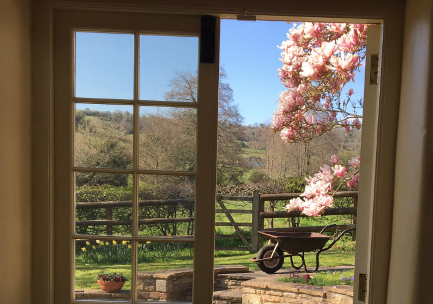


---

## Traditional Agile Wisdom

>_“The most efficient and effective method of conveying information to and within a development team is face-to-face conversation.”_ Agile Manifesto, 2001

----

## XP: Sit Together

> "most people agree that face to face conversation is the best form of communication, have your team sit together in the same space without barriers to communication, such as cubicle walls."

Notes:
XP teams sit together. This enables team members to collaborate quickly and effectively.
Not everyone likes to act in the moment without thinking time alone

----

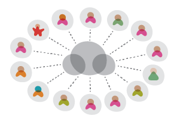
> "A remote-first team is one where everyone works in a separate location, usually from home, and thus all communication occurs online. Most open-source projects are remote-first, and this experience has encouraged many startups to use it." Fowler

Notes:

https://martinfowler.com/articles/remote-or-co-located.html

---

## "remote-first" @tes_engineering ?

----

## A bit about Tes

* Digital education company
* 200+ Javascript micro-services Node/React 
* 50+ full-stack engineers in 12 product squads
* Remote-first culture

Notes: 
Who's heard of the Times Educational Supplement? 
We are more than a publication, we provide services that help schools recruit teachers and for teachers to share teaching resources. We support and connect teachers and schools worldwide, helping them to improve children's lives through education. 
A few years ago, our CTO Clifton Cunningham and VP of Engineering David Morgantini led a transition to a micro-services architecture building up product teams with ThoughtWorks alumni. I wasn't working at the company at the time so can't share much detail on how our remote-first got started but Martin Fowler was writing about remote-first at the time. Over the past few years we've established some ways of working that help us sustain remote working and I'll be sharing some more practical details of how Hack Days and Knowledge Sharing sessions underpin our remote working practice.

----


----

## Team @tes_engineering 


Notes: Taken in Engineering Week
My talk today draws from my experiences at my current job and also insights from my fellow engineers. 

----

## Remote-First Policy

> "Any work done outside of the London office. This can include working on the train, working from home, or working from any location in the world where a team member is able to deliver their work."
https://engineering.tes.com/how-we-work/remote/

Notes: At Tes we follow the principle that remote participants should be respected. Even if most participants of a meeting are in the office, we will use video meeting if someone is remote. On the rare times that we have an in-person workshop with people in a room, we ensure that a proper mic is used so that everyone can hear the conversation.
Department wide meetings are often recorded for people who cannot attend due to timezone.

----

## Remote-First Rules

```
* Teams where one or more members working remotely some or all the time MUST adopt remote first practices.
* Teams MUST use an asynchronous chat tool such as Slack.
* All team members MUST be able to have some degree of time overlap the hours where the rest of the team is in the office (usually 10am - 6pm GMT).
* All team members MUST be able to find sufficiently reliable internet to be able to do voice conversations via Google Hangouts, Zoom, or appear.in. All team members SHOULD be able to find sufficiently reliable internet to have video conversations via the same.
* All team members (or members of teams with regular communication with a remote first team) MUST be equipped with a laptop, an adequate headset, and a functioning camera.
* All teams MUST have an adequate microphone for co-located team members. A snowball microphone has generally been found to be acceptable.
* All teams SHOULD have remote first meetings.
* All teams and team members MUST be mindful of their colleagues when they have meetings that involve remote attendees.
* All teams SHOULD conduct general conversation via a chat tool when possible.
* All team members MUST capture important decisions that are made during any voice or face to face conversations that occur during the normal course of the working day.
* The entire team SHOULD keep track of decisions that impact the whole team
* All team members SHOULD take part in the weekly demos.
* All teams MUST schedule meetings at times that work effectively for all required attendees and be willing to reschedule if/when attendees are unable to attend.
* All teams MUST have an effective way for team members to find and track the work they are responsible for.
* All team members SHOULD let their team know if they are doing something out of the ordinary.
* All team members MUST have VPN connectivity.
* All team members MUST have regular, scheduled one-to-ones with a mentor or line manager.
* All teams SHOULD have daily standups to ensure that: progress is being achieved, team members are not blocked, and there is at least some social interaction between team members.
* All team members COULD say good morning to their team in the morning and goodbye before they leave for the day.
* All teams SHOULD have regularly scheduled retrospectives to talk to the team about broader directions beyond the day-to-day conversation in standup.
* All public talks and knowledge-sharing sessions MUST be recorded to be shared across remote teams.
* All team members MUST ensure that they working in the most effective location for them.
* All team members MUST ensure that they are able to find intrinsic or extrinsic motivation in the work they are doing.
* All team members who work remotely some or all of the time MUST ensure that their environment is suitable for remote working.
* All team members SHOULD respond to messages in the chosen chat tool within a reasonable period of time
* You are responsible for any travel and all accommodation and other costs as this is not travel conducted at the company’s request.
```

----

## Remote-First in practice

We follow the principle that remote participants should be respected.

Even if most participants of a meeting are in the office, we will use video meeting if one person is remote. 

On the rare occaision that we have an in-person workshop with people in a room, we ensure that a proper mic is used so that everyone can hear the conversation.

Department wide meetings are often recorded for people who cannot attend due to timezone.

----

## Remote vs Office

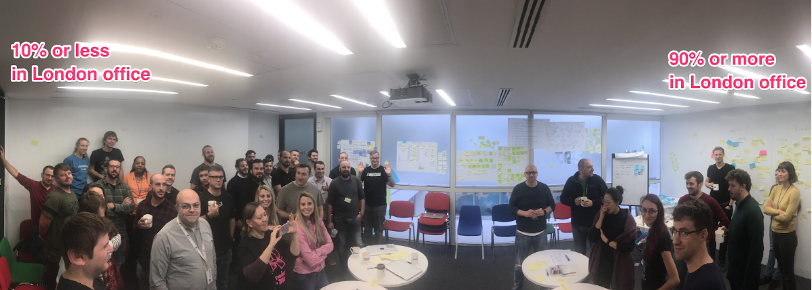

Notes: 

----


Notes: 
Survey question: What are the benefits for you when working remotely?
* Flexibility: time / place / family
* Saves time & money spent on commuting
* Removes travel stress
* Control over work environment
* Focus time

----

## Quotes from Survey

* "It changed my life! I can't go back to the pain of commuting to Central London everyday."
* "I'm wayyy more productive working remotely."
* "I find remote pairing as good as if not better than actually pairing in person."
* "I think it takes experimentation to work out what's right for you."

----

## Also

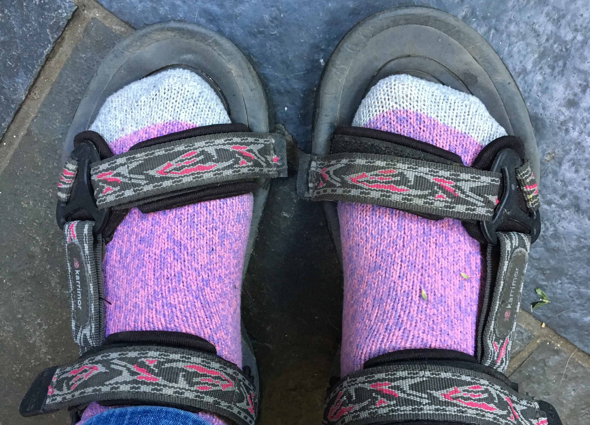

----

## Tools We Use

* Zoom for video calls and screen-sharing
* Slack for messaging
* Github + Zenhub for tickets
* Containers for easy remote development
* Miro for whiteboard

----

## Contact Habits

* Mark availability in Slack
* Chat about personal stuff before stand-up/pairing
* Remote pairing with video on

Notes: 
Survey question: What habits do you have to stay in good contact with your team mates?

----

## Pairing / Mobbing 

* Driver shares screen
* Swap every hour or so
* Push WIP to branch
* Work solo for simple tasks

Notes: 

----

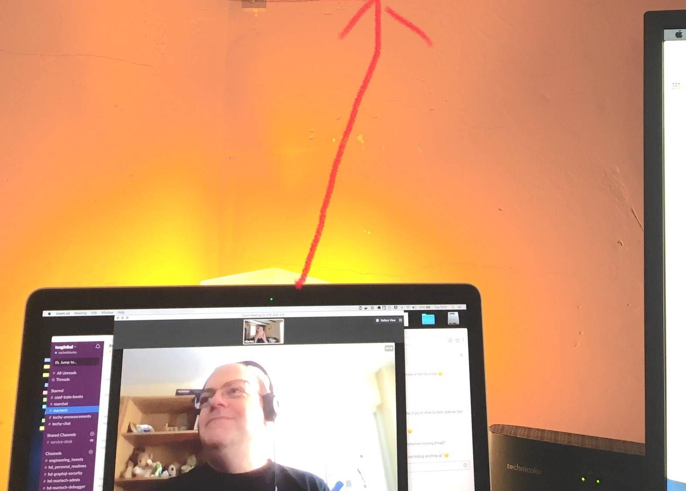

----

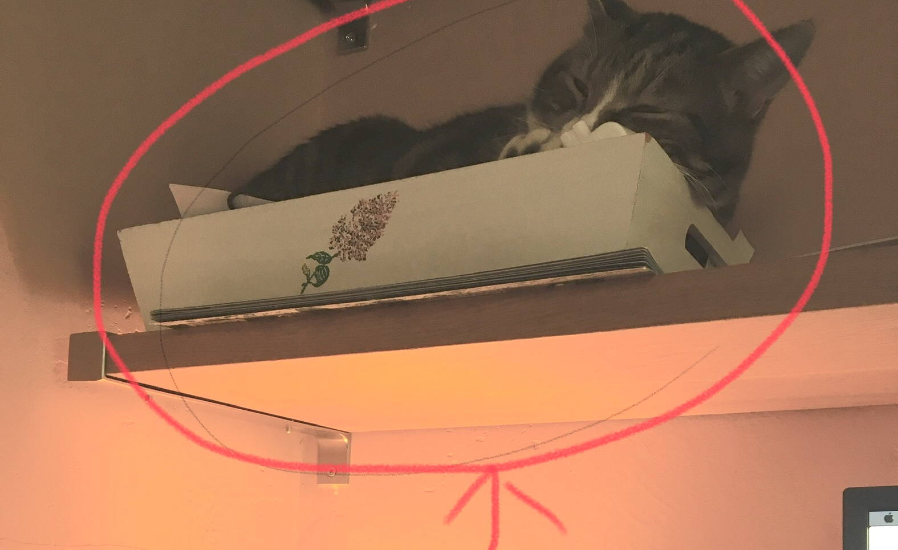

----

## Cross-team meetings

----

## Product Demo

* Every Tuesday across all product teams
* Video recorded

----

## Monthly Hack Days

* 2 days every month
* Innovation & improvement
* Showcase & T-shirts

----

## Knowledge Sharing

* Every week
* Talks and conference reports


----

## Drawbacks?


Notes: 
Survey question: What are the drawbacks for you when working remotely?
* Loneliness & isolation
* Lack of spontaneous chat
* Asking for help
* Switching off in the evening
* Team communication across timezones

----

## What do you miss?


Notes: 
Survey question: Is there anything you miss about working in the office environment?
* Spontaneous conversations
* Seeing friends not in my team
* Team lunches & coffees
* Range of shops


----

## Regular 1:1 
## meetings
### mentor + principal

Notes: all engineers have a mentor and a principal engineer with 1:1 meetings every couple of weeks

----

## Coffee Roulette


----

## Sharing Moments

* Unboxing ceremonies
* House tours
* Window views
* Pets & babies

Notes: 
Some of the personal sharing moments shared as remote workers

----

## Conference Trips

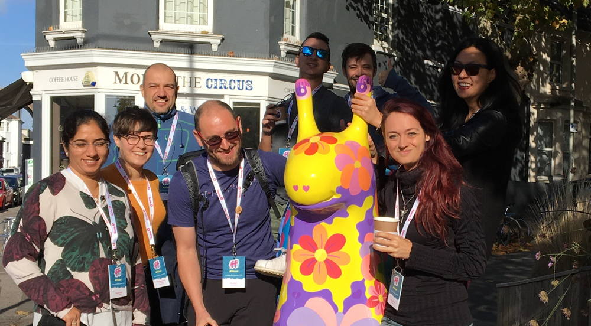

----

## Engineering Week


https://engineering.tes.com/post/tes-engineering-week-2018/

Notes:

----

## Remote Party

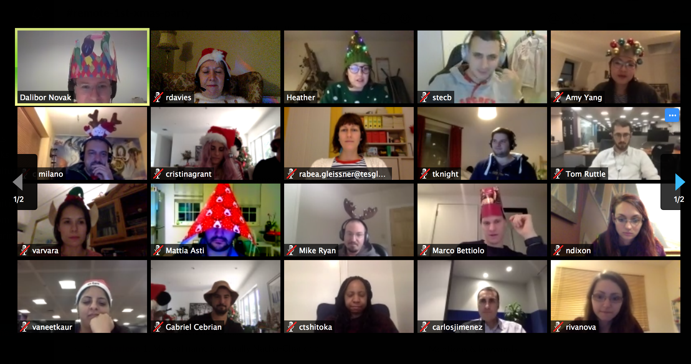

https://engineering.tes.com/post/remote-christmas-party/

----

## Personal Profiles

https://engineering.tes.com/post/personal-readme-experiment/

----

## Tips from Engineers

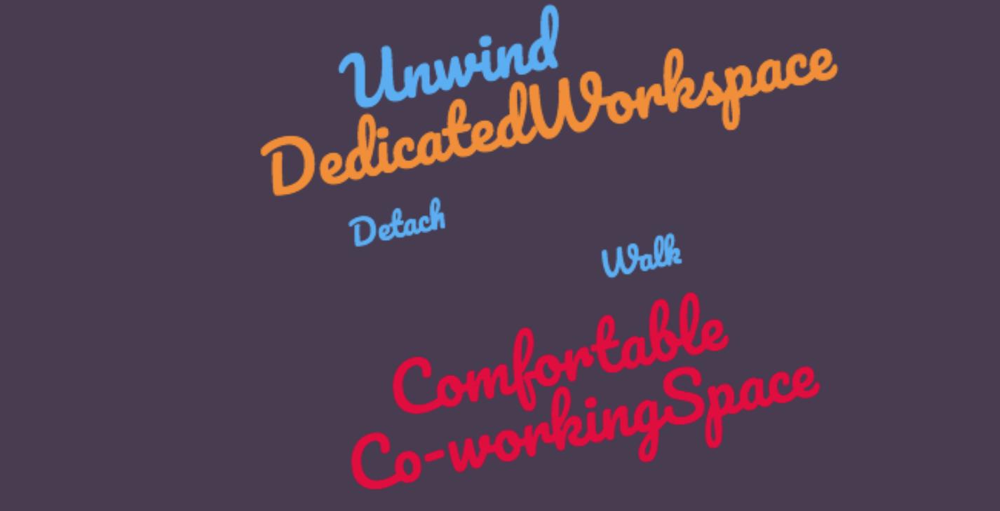

Notes: 
Survey question: What tips do you have for a good remote work environment?
* Dedicated comfortable workspace
* Get dressed for work
* Try co-working space
* End of day: detach & unwind
* Go out for a daily walk

----

## Anything Else?

* Worry that in office workers get more promotion
* Demonstrating you're doing your job and not slacking
* Option to work in office suits some people

Notes: 
Survey question: Anything else you'd like to say about working remotely?

---

## Business Benefits

* Widen talent pool
* Retain skilled engineers
* Less office space required
* Work day spans multiple timezones

---

## Philosophy & History

----

## Remote Working is not a new concept

----

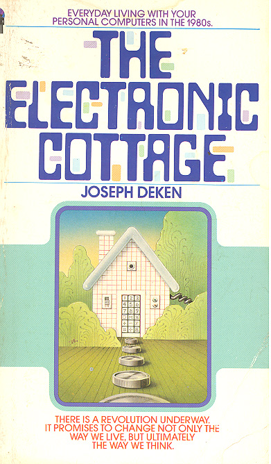

Notes: 
A movement in 1980s that died out

----

## F International


Notes: 
F International was a British freelance software and systems services company, founded as Freelance Programmers in England in 1962, by Dame Stephanie Shirley; she was involved in the company until she retired in 1993. The company was renamed in 1974 to F International. In 1988 the company was renamed again, to The FI Group, and later as Xansa plc. Xansa plc was acquired by the French company now known as Sopra Steria in 2007.

----

## The Office

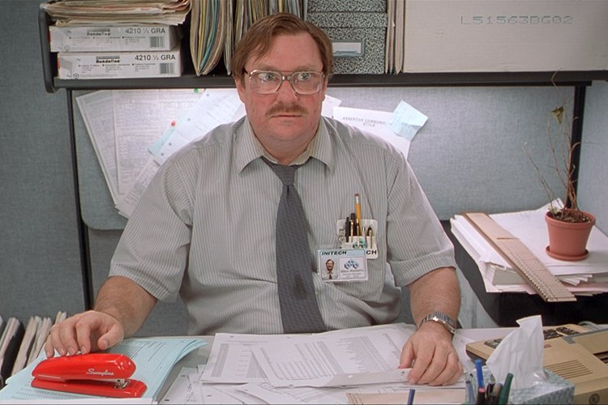

Notes: The main purpose of an office environment is to support its occupants in performing their jobs. The rise of the office in London came with the East India Company. It makes sense to be located with the paperwork. 
Photo from Office Space movie 1999

----

## Software is Special


Notes: I was trying to describe what it's like to make software to my neighbour. Software as a material is not like a physical material. If you make an egg-cup it can be used by 1 person at a time in the same location. If you make software, it can be used by many people in different locations at the same time.

----

## Modern Open Workspace

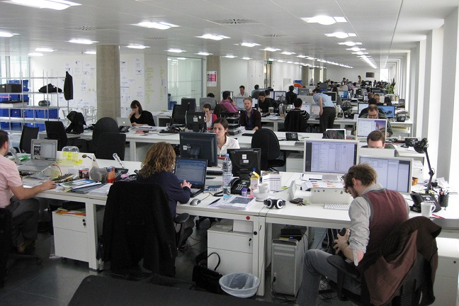

Notes: The picture at the top of this post is of the office I work in.  It is an open office plan.  There happen to be offices with doors for managers.  Their office walls, however, as well as their doors are made of glass.  This allows management to more easily observe us, just as it allows us to more easily watch management.
http://www.imaginativeuniversal.com/blog/2014/03/10/the-open-office-and-panopticism/

----

## Supervision of Office Work

> “for the intellectual work, separate rooms are necessary so that a person who works with his head may not be interrupted; but for the more mechanical work, the working in concert of a number of clerks in the same room under proper superintendence, is the proper mode of meeting it” 

1856: UK government report

----


> "a new mode of obtaining power of mind over mind." Panopticon prison design, Bentham, 1785 

Notes:
The Panopticon is a concept for a prison designed by Jeremy Bentham, the father of utilitarianism.  The idea behind it was to have a prison designed in a ring so that every prisoner was constantly being observed by other prisoners.  Additionally, there was a tower in the center of the ring that provided the only privacy available in the prison layout.  The tower housed guards, but inmates could never be sure how many were watching them at any time.  What is important in the design is that prisoners always feel as if they are being watched.  Under constant surveillance of this sort, it was hoped, would cause prisoners to behave morally and hence undergo rehabilitation through self-discipline as well as punishment.  The Panopticon would put them on their best behaviour.

----

> “Visibility is a trap.” 
― Michel Foucault, Discipline and Punish: The Birth of the Prison

Notes: 
“He who is subjected to a field of visibility, and who knows it, assumes responsibility for the constraints of power; he makes them play spontaneously upon himself; he inscribes in himself the power relation in which he simultaneously plays both roles; he becomes the principle of his own subjection.” 
― Michel Foucault, Discipline and Punish: The Birth of the Prison

---

## Summing Up

* Clear "remote-first" policy
* Invest in cross-team initiatives
* Support for social time

Notes: Summing up ^^

---

## Thank You
#### @rachelcdavies @tes_engineering


Notes: We're hiring :-)

Curious about how to build and sustain a ‘remote-first’ culture? At Tes we have more engineers working from home or travelling than sitting at a desk in our London office. Over the last few years we adapted our engineering practices to support small teams working in close collaboration over distance. Part of what sustains this way of working is the way we organise hack days and engineering weeks and other cross-team initiatives.

